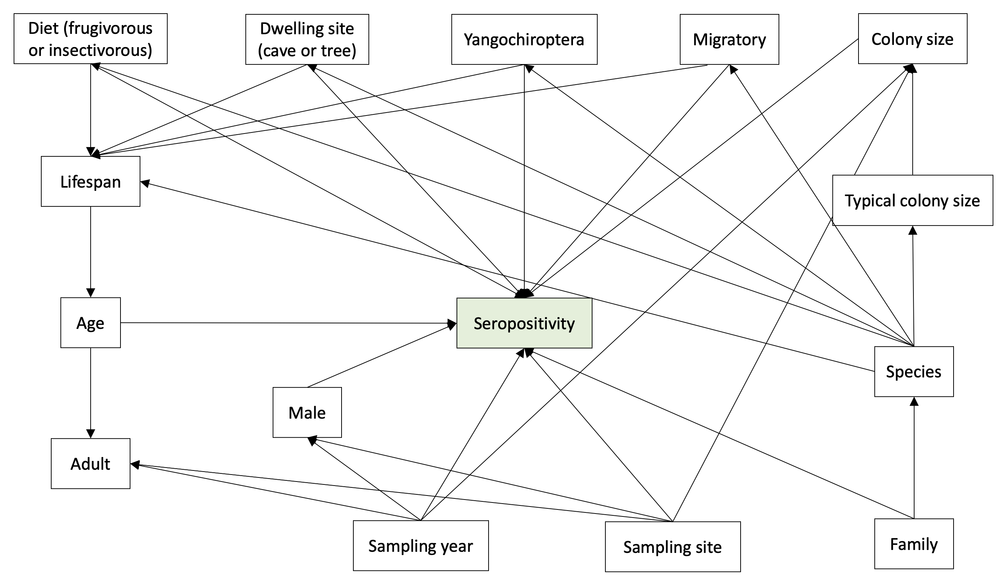

This repo contains the code for the statistical analyses used in **"A global multiregional serosurvey of RNA virus-reactive antibodies in bats and rodents"**, submitted to *PLOS Neglected Tropical Diseases*.

## Code

The code for the regression analyses is in `notebooks/stats_analyses.ipynb`. 
Necessary libraries are specified in the `environment.yml` file.

## The models

The statistical models are based on the following DAG.

You can recreate and play around with it by pasting the following into the 
`Model code` box on the lower right on `dagitty.net`:
```
dag {
bb="0,0,1,1"
"Colony size" [latent,pos="0.861,0.104"]
"Diet (frugivorous or insectivorous)" [adjusted,pos="0.108,0.106"]
"Dwelling site (cave or tree)" [adjusted,pos="0.283,0.108"]
"Sampling site" [adjusted,pos="0.482,0.934"]
"Sampling year" [adjusted,pos="0.378,0.933"]
"Sero positive" [outcome,pos="0.439,0.611"]
"Typical colony size" [adjusted,pos="0.862,0.401"]
Adult [adjusted,pos="0.114,0.746"]
Age [latent,pos="0.113,0.607"]
Family [adjusted,pos="0.865,0.923"]
Lifespan [adjusted,pos="0.110,0.372"]
Male [adjusted,pos="0.326,0.719"]
Migratory [adjusted,pos="0.654,0.102"]
Species [pos="0.864,0.732"]
Yangochiroptera [adjusted,pos="0.475,0.105"]
"Colony size" -> "Sero positive"
"Diet (frugivorous or insectivorous)" -> "Sero positive"
"Diet (frugivorous or insectivorous)" -> Lifespan
"Dwelling site (cave or tree)" -> "Sero positive"
"Sampling site" -> "Colony size"
"Sampling site" -> "Sero positive"
"Sampling site" -> Adult
"Sampling site" -> Family
"Sampling site" -> Male
"Sampling site" -> Species
"Sampling year" -> "Colony size"
"Sampling year" -> "Sampling site"
"Sampling year" -> "Sero positive"
"Sampling year" -> Adult
"Sampling year" -> Male
"Typical colony size" -> "Colony size"
Age -> "Sero positive"
Age -> Adult
Family -> "Sero positive"
Family -> Species
Lifespan -> Age
Male -> "Sero positive"
Migratory -> "Sero positive"
Migratory -> Lifespan
Species -> "Diet (frugivorous or insectivorous)"
Species -> "Dwelling site (cave or tree)"
Species -> "Typical colony size"
Species -> Lifespan
Species -> Migratory
Species -> Yangochiroptera
Yangochiroptera -> "Sero positive"
Yangochiroptera -> Lifespan
}
```
**Note:**
We were unable to identify a directed acyclic graph (DAG) fully consistent with the data, as assessed by its testable implications. This suggests the presence of unobserved variables, missing or incorrect connections between variables, or non-linear associations.

We evaluated two statistical models:

- **Model A (simpler):**
  Includes all DAG variables except *region*, *sampling site*, *species*, *family*, *lifespan*, and *age* (the latter due to missing data). While we initially intended to include *lifespan*, this led to convergence issues.

- **Model B (more complex):**
  Incorporates all DAG variables except *species*. *Species* was excluded as its inclusion resulted in substantial uncertainty in parameter estimates. For more interpretable results, we included *bat family* as a variable.


## Technical details

To address potential bias arising from sampling across different years and regions, **country** and **year** were included as random effects interaction variables in Model B. Additionally, **bat family** was incorporated as a random effects variable, while the remaining variables were treated as fixed effects.

**Colony size** was log-transformed and standardized (mean = 0, standard deviation = 1). To account for the uncertainty in **colony size**—values were sourced from the literature, but even if accurate, substantial within-species variation is expected—it was modeled as an uncertain measurement. Literature-based **colony size** values (logged) were used as the means of normal distributions, from which the model sampled the "actual" **log colony sizes** during regression. A distinct colony size was assumed for each combination of sampling site, year, and species, though this approach does not account for the possibility of multiple species cohabiting in the same colony at a given site.

Similarly, uncertainty in **lifespan** values (obtained online) was addressed using the same method as for **colony size**. For species with unknown **lifespan**, an average value of 12 years was assumed. The standard deviations of the normal distributions varied depending on the availability of **lifespan** data: whether it was available for the species, only for a species within the same genus, or not available for either the species or genus.


## Results

The results of models A and B can be found in `results/modelA` and `results/modelB`. 
These include, for each virus, forest plots and tables reporting estimated parameter sizes.

## Figures

The `figures` directory includes a heatmap illustrating correlations between detected seropositivities across different viruses, a world map highlighting countries where sampling took place and ...

**Figures with the prefix `seroposrate`** displaying mean seropositivities for each virus (as indicated by the file suffixes) and for each combination of bat species, sampling site, and sampling year.
  
  - **Figures with the suffix `BySpecies`** presenting average seropositivities sorted by bat species. Gray vertical lines demarcate transitions between different species. Dot colors represent sampling sites (i.e., dots of the same color indicate mean seropositivities for bat species sampled from the same site), and dot sizes are proportional to the number of samples collected.
  
  - **Figures with the suffix `BySite`** showing seropositivities sorted by site. Dot colors indicate bat species, gray vertical lines demarcate transitions between different sites, and black vertical lines highlight transitions between countries (in the following order: Gabon, Republic of Congo, Germany, Ghana, Panama).


## Limitations

- **Representativeness of the sample:**
  The sample may not be fully representative, particularly when attempting to derive broad relationships such as those between diet and seropositivity. To improve generalizability, additional data from more species and genera, diverse geographic regions, and different time periods would be beneficial. This limitation can be summarized as a lack of overlap across various data subgroups or stratifications.

- **Colony size assumptions:**
  The *colony size* variable does not account for potential co-roosting of multiple species. Consequently, the assumed typical *colony sizes* for certain species may be misleadingly low.

- **Uncertainty in lifespan data:**
  Data on species lifespans is incomplete and uncertain. The high level of uncertainty likely reduces the model’s ability to identify potential associations.

- **Genetic impact assumptions:**
  While we assume genetics may influence seropositivity at the bat family level, differences likely exist even at the species level. However, addressing this leads to subsets of perfectly correlated variables, complicating the analysis.

- **Antibody cross-reactivity:**
  There is substantial antibody cross-reactivity, particularly within virus families. This cross-reactivity may significantly affect seropositivity measurements for specific viruses.
